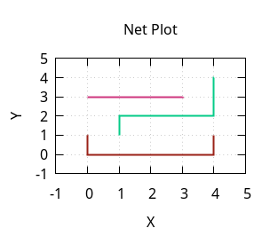
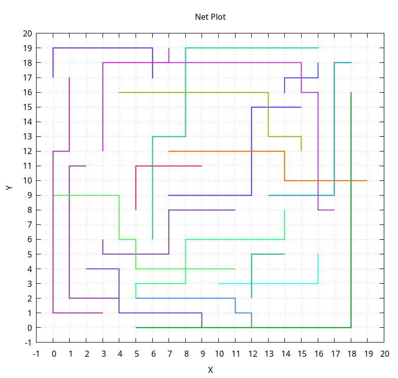
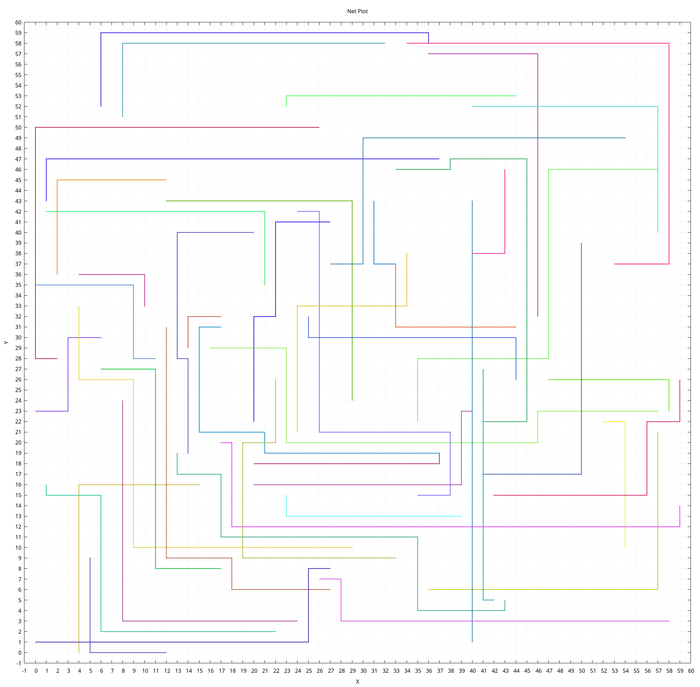

# Detailed Routing for Photonic Integrated Circuits (PICs)

## Prerequisites

- g++
- gnuplot

## Usage

1.  Compile to get `picRouting`
    ```bash
    make all
    ```
2.  Select an input file, e.g. `test/pic5x5.in`, or generate one with:
    ```bash
    ./testGenerator <size> [propagationLoss] [crossingLoss] [bendingLoss] [numNet]
    ```
    Output filename will be `test/pic{size}x{size}.in`

3. Routing
    ```bash
    ./picRouting <input.in> <output.out>
    ```
    This will also generate a `output.gp`, use it with `gnuplot output.gp`.

## Routing Result

```bash
$ test/pic_routing_verification test/pic5x5.in test/pic5x5.out
parse input file...
parse output file...
waveguide length : 15
crossings : 0
bends : 4
waveguide loss : 27
error : 0
```

```bash
$ test/pic_routing_verification test/pic20x20.in test/pic20x20.out
parse input file...
parse output file...
waveguide length : 270
crossings : 21
bends : 48
waveguide loss : 825
error : 0
```

```bash
$ test/pic_routing_verification test/pic60x60.in test/pic60x60.out
parse input file...
parse output file...
waveguide length : 1512
crossings : 57
bends : 96
waveguide loss : 2370
error : 0
```



```
$ test/pic_routing_verification test/pic512x512.in test/pic512x512.out
parse input file...
parse output file...
waveguide length : 180523
crossings : 14642
bends : 2967
waveguide loss : 335844
error : 0
```
